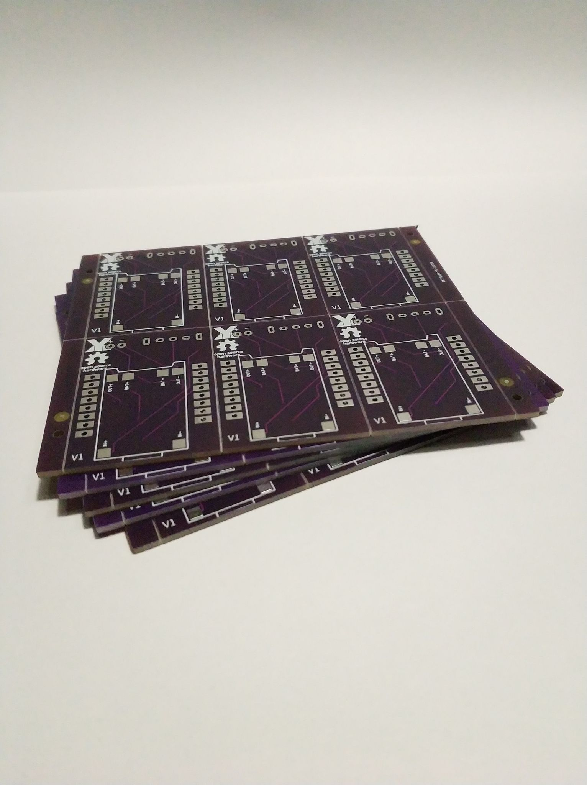
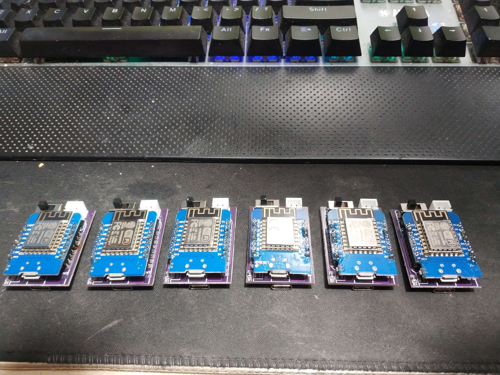

# SlimeVR DIY PCB V2 by Yexo 
Small PCB made for small trackers the biggest issue is the battery like always but still...  
  
No extensions to make it smaller
  
  
Parts:   
Switch : SS12T44
  
Battery Connector: JST 2.54 2pin
  
Diodes : SS14 SMD
  
Resistor : 180k (0805)
  
D1 Mini ESP8266
  
  
IMUS:  
 tested:  
 MPU 6050    

 untested:  
 BNO085 (there is a int pin pins that you need to short if you need the int pin)  

